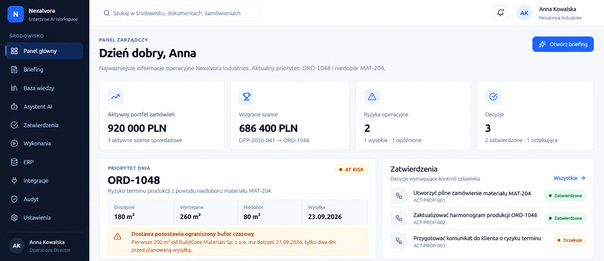
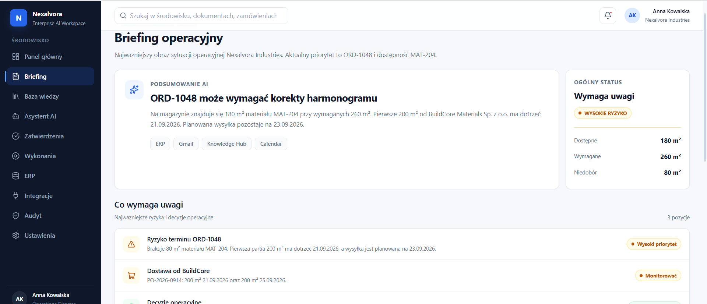
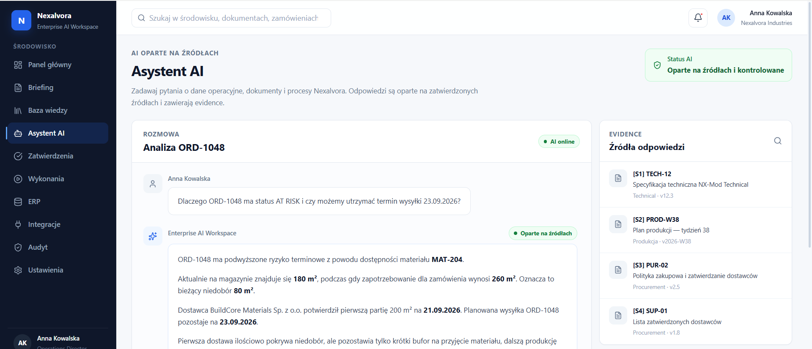
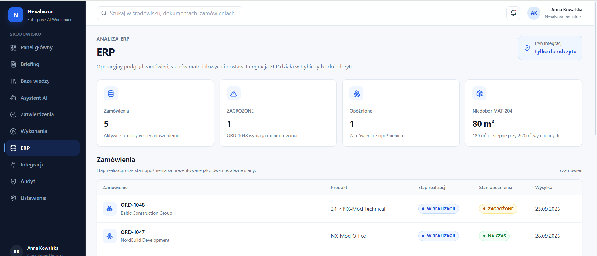
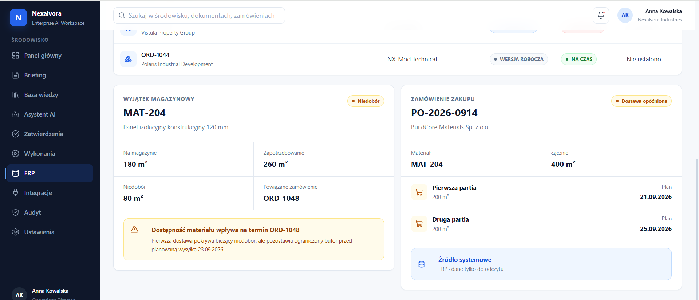
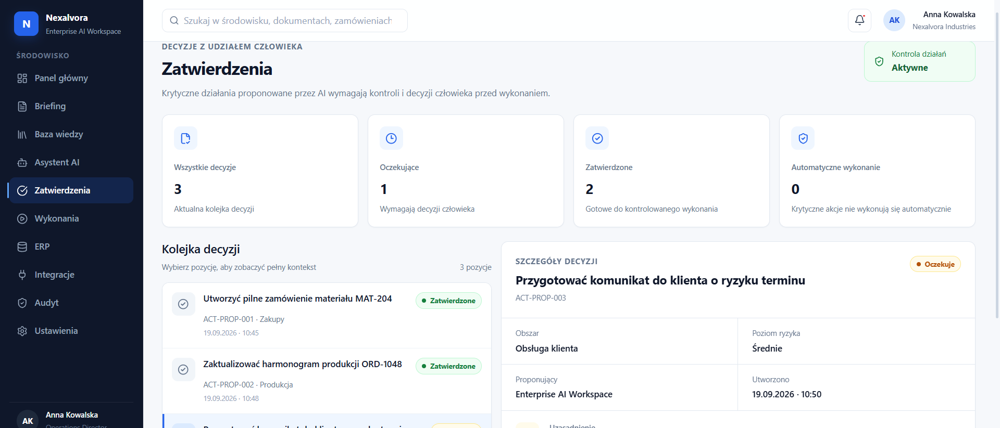
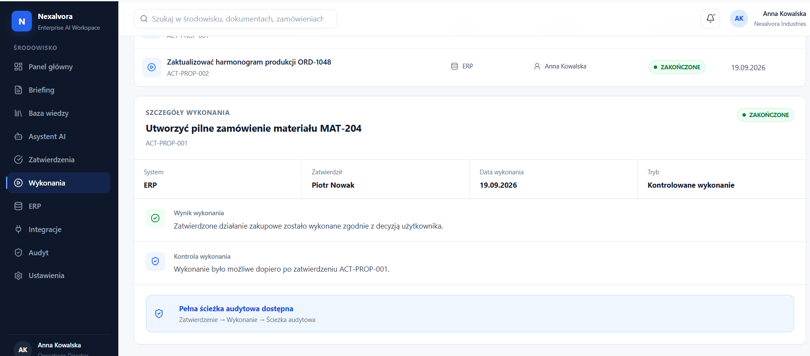
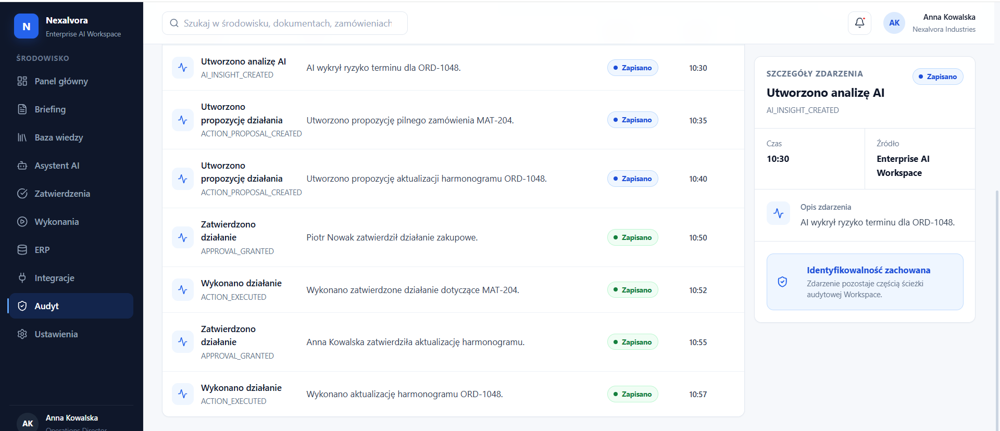
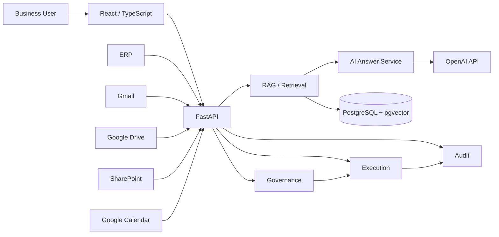

# Enterprise AI Workspace

Enterprise AI workspace for operational intelligence, RAG-based knowledge access, human approvals, controlled execution and audit traceability.

Built as a functional enterprise demo around a realistic production scenario for the fictional company **Nexalvora Industries Sp. z o.o.**

**Stack:** Python · FastAPI · React · TypeScript · PostgreSQL · pgvector · OpenAI API · Docker

---

## Overview

The goal of Enterprise AI Workspace is to help employees find the information they need faster, reduce time spent searching across documents and business systems, and support better operational decisions with AI-assisted access to trusted company knowledge.

The workspace complements existing company infrastructure by connecting information across ERP, email, documents and internal systems without replacing the tools already used by the business.

The system connects operational data, internal knowledge and AI-assisted decision support in one workspace.

It covers the full flow from detecting a business risk to recording the resulting action:

```text
Operational data
      ↓
Risk detection
      ↓
AI analysis + evidence
      ↓
Action proposal
      ↓
Human approval
      ↓
Controlled execution
      ↓
Audit trail
```

Key modules:

- Executive Dashboard
- Executive Briefing
- Knowledge Hub
- RAG / evidence retrieval
- AI Assistant
- Approvals
- Executions
- ERP Intelligence
- Enterprise Integrations
- Audit & Traceability
- Workspace Settings

---

## Main Demo Scenario

The primary scenario is based on customer order:

```text
ORD-1048
```

### Business context

```text
Order:          ORD-1048
Customer:       Baltic Construction Group
Product:        24 × NX-Mod Technical
Shipment:       23.09.2026
Risk state:     AT_RISK
```

Production requires:

```text
MAT-204
Structural Insulated Panel 120 mm
```

Inventory situation:

| Metric | Value |
|---|---:|
| Available | 180 m² |
| Required | 260 m² |
| Shortage | 80 m² |
| Safety stock | 300 m² |

The related purchase order:

```text
PO-2026-0914
```

is delayed and split into two deliveries:

```text
200 m² → 21.09.2026
200 m² → 25.09.2026
```

The second delivery arrives after the planned customer shipment date.

The workspace connects this operational risk with supporting evidence, creates a recommendation, routes the proposed action through human approval, records the execution and preserves the complete audit trail.

---

# Screenshots

## Executive Dashboard

Operational overview of the main production risk, business decisions and current workspace state.



---

## Executive Briefing

AI-assisted operational briefing focused on the `ORD-1048` delivery risk and `MAT-204` material shortage.



---

## Grounded AI Assistant

Evidence-backed analysis of `ORD-1048` with explicit references to approved enterprise sources.



---

## ERP Intelligence

Operational view of customer orders with lifecycle and delivery-risk states modeled independently.



Material shortage and supplier delivery context for the primary demo scenario.



---

## Human-in-the-Loop Approvals

Business actions proposed by the system remain subject to explicit human review before execution.



---

## Controlled Execution

Approved actions are executed through a separate controlled execution layer with reviewer and result traceability.



---

## Audit & Traceability

The audit trail preserves the sequence from AI insight through proposal, approval and execution.



---

# Architecture



The current demo models external enterprise systems as controlled read-only sources.

---

## RAG & AI Reliability

The AI layer is separated into explicit stages:

```text
Question
   ↓
Retrieval
   ↓
Evidence selection
   ↓
Context construction
   ↓
Answer generation
   ↓
Citation validation
   ↓
Grounded response
```

Implemented reliability mechanisms include:

- evidence-based context
- explicit source identifiers
- citation validation
- source freshness controls
- evidence-distance thresholds
- structured answer handling
- provider abstraction
- deterministic validation
- failure-aware AI flows

Example evidence used by the main scenario:

```text
TECH-12   Technical specification
PROD-W38  Production plan
PUR-02    Procurement policy
SUP-01    Approved supplier information
```

---

## Human-in-the-Loop Governance

AI recommendations are not treated as authorization.

Business actions follow a separate lifecycle:

```text
Proposal
   ↓
Human review
   ↓
Approval
   ↓
Execution
   ↓
Audit
```

Example:

```text
ACT-PROP-001
Urgent procurement action for MAT-204

Approved by:
Piotr Nowak
```

This keeps business decisions separate from AI-generated recommendations.

---

## ERP Model

Order lifecycle and operational delay are intentionally modeled as separate states.

```text
Lifecycle:
DRAFT
IN_PROGRESS
READY
```

```text
Delay state:
ON_TIME
AT_RISK
DELAYED
```

This prevents operational risk from being mixed with the actual order lifecycle.

---

## Audit & Traceability

The audit layer records events such as:

```text
AI_INSIGHT_CREATED
ACTION_PROPOSAL_CREATED
APPROVAL_GRANTED
ACTION_EXECUTED
```

Technical event identifiers remain stable internally while the UI presents localized human-readable labels.

The audit trail preserves the relationship between:

- business signal
- AI insight
- action proposal
- reviewer
- execution
- timestamp
- result

---

# Technology

## Backend

- Python 3.12
- FastAPI
- Pydantic
- PostgreSQL
- pgvector
- OpenAI API

## Frontend

- React 19
- TypeScript
- Vite
- React Router
- Lucide React
- custom enterprise UI system

## Infrastructure

- Docker
- Docker Compose
- PostgreSQL / pgvector
- environment-based configuration
- health checks
- readiness checks
- non-root runtime
- read-only filesystem
- `no-new-privileges`

---

## Engineering Quality

The project is covered by automated quality gates.

```text
Ruff
All checks passed

mypy
179 source files
0 issues

pytest
579 passed

Frontend lint
0 warnings
0 errors

Frontend production build
Successful
```

Testing covers backend architecture, retrieval and AI-related behavior, validation, governance and supporting application logic.

---

# Repository Structure

```text
enterprise-ai-workspace/
│
├── backend/
│   └── app/
│       ├── ai/
│       ├── retrieval/
│       ├── api/
│       ├── services/
│       └── ...
│
├── frontend/
│   └── src/
│       ├── components/
│       ├── layout/
│       ├── pages/
│       ├── styles/
│       └── data/
│
├── docs/
│   └── screenshots/
│
├── tests/
├── migrations/
├── docker-compose.yml
└── README.md
```

---

# Run Locally

## Backend

Activate the Python environment and start the API:

```bash
uvicorn backend.app.main:app --reload
```

API:

```text
http://localhost:8000
```

Health check:

```text
http://localhost:8000/health
```

Example response:

```json
{
  "status": "ok",
  "service": "enterprise-ai-workspace-api"
}
```

---

## Frontend

```bash
cd frontend
npm install
npm run dev
```

Application:

```text
http://localhost:5173
```

---

# Quality Checks

Backend:

```bash
ruff check backend
mypy backend
pytest
```

Frontend:

```bash
cd frontend
npm run lint
npm run build
```

---

# Demo Scope

This repository is a functional engineering demo, not a production deployment connected to real company accounts.

All business data is synthetic, including:

- company data
- employees
- customers
- suppliers
- ERP orders
- purchase orders
- documents
- approvals
- executions
- audit events

External integrations such as Gmail, Google Drive, SharePoint, Calendar and ERP are represented as controlled enterprise connectors in the demo architecture.

---

# My Contribution

Designed and implemented the project end to end, including:

- system architecture
- business-process modeling
- FastAPI backend
- PostgreSQL / pgvector data layer
- RAG architecture
- retrieval and evidence handling
- grounded AI answer pipeline
- citation validation
- AI reliability controls
- approval and governance model
- execution model
- audit trail
- ERP intelligence
- React / TypeScript frontend
- enterprise UI system
- Docker runtime
- runtime hardening
- automated tests
- static typing
- end-to-end validation

---

# Current Status

The core architecture and primary business workflow are implemented and validated.

```text
ORD-1048
→ MAT-204 shortage
→ supplier delay
→ AI analysis
→ evidence-backed recommendation
→ human approval
→ controlled execution
→ audit trail
```

The next productization phase would add:

- production authentication
- user administration
- live enterprise connector authorization
- profile management
- organization-specific configuration
- production deployment
- monitoring and backup policies

---

# Author

**Yevhenii Kuksa**

AI Automation / AI Solutions

GitHub:

```text
Yevhenii-Kuksa
```
